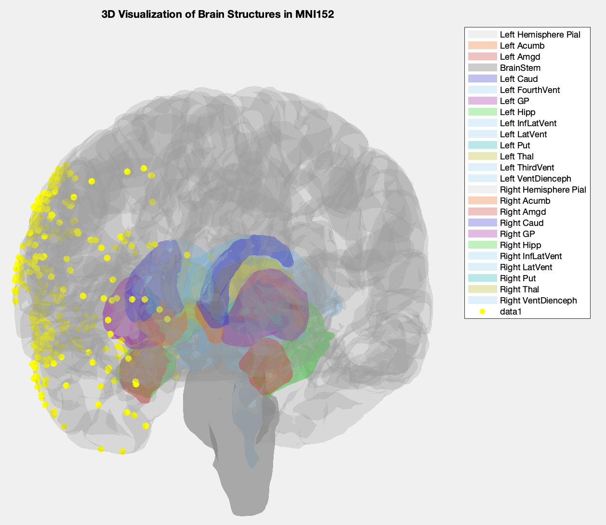

# Brain_Plotting_Tools
MATLAB scripts for visualizing deep brain structures and electrodes in MNI152 space

# Brain Visualization Toolbox for MATLAB

 This repository provides MATLAB scripts for visualizing deep brain structures and implanted electrodes in the MNI152 standard space. It is designed to help researchers quickly generate 3D visualizations for neuroimaging data analysis and presentation.

## Features

* **Comprehensive Brain Structures:** Includes visualization of major cortical surfaces (pial) and subcortical structures (e.g., Amygdala, Hippocampus, Thalamus, Basal Ganglia, Ventricles, Brainstem).
* **Customizable Views:** Easily switch between left and right hemisphere views.
* **Electrode Visualization:** Supports overlaying custom electrode coordinates (e.g., from `EC137_electrode.mat`) onto the brain models.
* **Intuitive Coloring:** Predefined color schemes for different brain regions for better anatomical identification.
* **Lighting and Transparency:** Configurable lighting and transparency settings for enhanced 3D perception.

## Getting Started

### Prerequisites

* MATLAB (R2018b or later recommended)
* No specific MATLAB toolboxes are strictly required beyond the basic installation for the core functionality.

### Installation

1.  **Clone the repository:**
    Open MATLAB and run the following command in the Command Window, or use MATLAB's built-in Git integration:
    ```bash
    git clone [https://github.com/Donghyeok91/Brain_Plotting_Tools.git](https://github.com/Donghyeok91/Brain_Plotting_Tools.git)
    ```
    (Replace `Donghyeok91/Brain_Plotting_Tools` with the actual path to this repository.)

2.  **Add to MATLAB Path:**
    Navigate to the cloned `Brain_Plotting_Tools` directory in MATLAB's Current Folder browser.
    Right-click on the `scripts` folder and select "Add to Path" -> "Selected Folders and Subfolders". This ensures MATLAB can find the functions.

### Usage

The primary script for demonstrating the visualization is `Brain_plot_test.m`.

1.  **Open `Brain_plot_test.m`:**
    Navigate to the `scripts` folder within your cloned repository and open `Brain_plot_test.m` in the MATLAB Editor.

2.  **Run the script:**
    You can run the script directly from the MATLAB Editor by pressing the "Run" button, or by typing `Brain_plot_test` in the Command Window.

    ```matlab
    % Example: Plotting left hemisphere structures with electrodes
    Brain_plot_test;
    ```

3.  **Customizing the plot:**
    The `plot_deep_brain_structures` function allows for customization:
    ```matlab
    % plot_deep_brain_structures(file_list, view_side, use_light)
    %   file_list   : Cell array of paths to .mat files (e.g., from 'data/brain_structures/')
    %   view_side   : 'l' for left view, 'r' for right view
    %   use_light   : 1 to use lighting, 0 otherwise

    % Example: Plotting right hemisphere structures
    % Ensure you have the corresponding 'r' hemisphere files in your file_list
    % plot_deep_brain_structures(file_list_right_hemisphere, 'r', 1);

    % You can comment out or modify the `scatter3` line in `Brain_plot_test.m`
    % to show/hide electrodes or change their appearance.
    ```

## Data Files

The `data/brain_structures/` folder contains `.mat` files for various brain regions. These files typically contain a `cortex` struct with `vert` (vertices) and `tri` (triangles) fields, representing the mesh data for each structure.

* `cvs_avg35_inMNI152_lh_pial.mat`: Left hemisphere pial surface.
* `cvs_avg35_inMNI152_rh_pial.mat`: Right hemisphere pial surface.
* `lAcumb_subcort.mat`, `rAcumb_subcort.mat`: Left/Right Accumbens.
* `lAmgd_subcort.mat`, `rAmgd_subcort.mat`: Left/Right Amygdala.
* `lCaud_subcort.mat`, `rCaud_subcort.mat`: Left/Right Caudate.
* `lGP_subcort.mat`, `rGP_subcort.mat`: Left/Right Globus Pallidus.
* `lHipp_subcort.mat`, `rHipp_subcort.mat`: Left/Right Hippocampus.
* `lPut_subcort.mat`, `rPut_subcort.mat`: Left/Right Putamen.
* `lThal_subcort.mat`, `rThal_subcort.mat`: Left/Right Thalamus.
* `lBrainStem_subcort.mat`: Brainstem (shared for both hemispheres).
* **Ventricles:** `lFourthVent_subcort.mat`, `lInfLatVent_subcort.mat`, `lLatVent_subcort.mat`, `lThirdVent_subcort.mat`, `lVentDienceph_subcort.mat` and their right counterparts where applicable.
* `EC137_electrode.mat`: Example electrode coordinates file.

## Contributing

Contributions are welcome! If you have suggestions for improvements, bug fixes, or new features, please open an issue or submit a pull request.

## License

This project is licensed under the [MIT License](LICENSE).

## Contact

For questions or support, please contact [Donghyeok Lee/donghyeok.lee@ucsf.edu].
